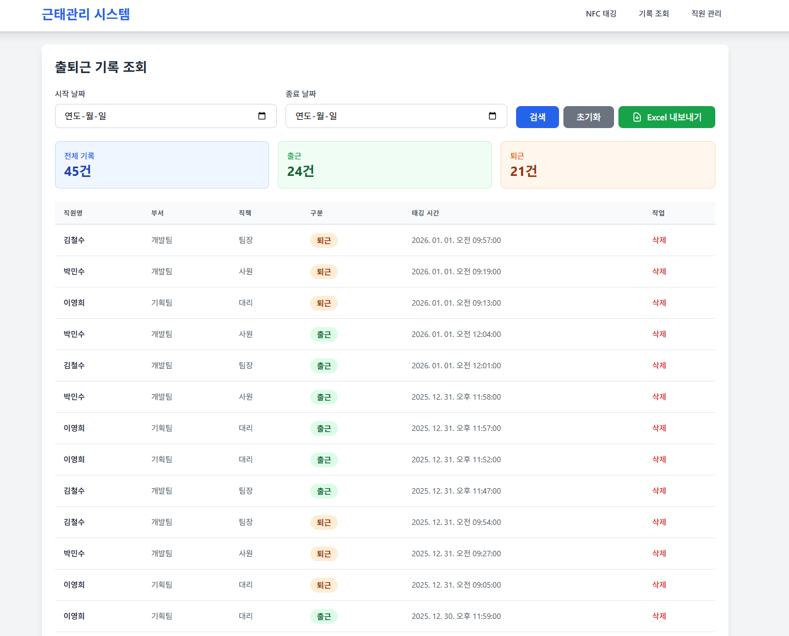
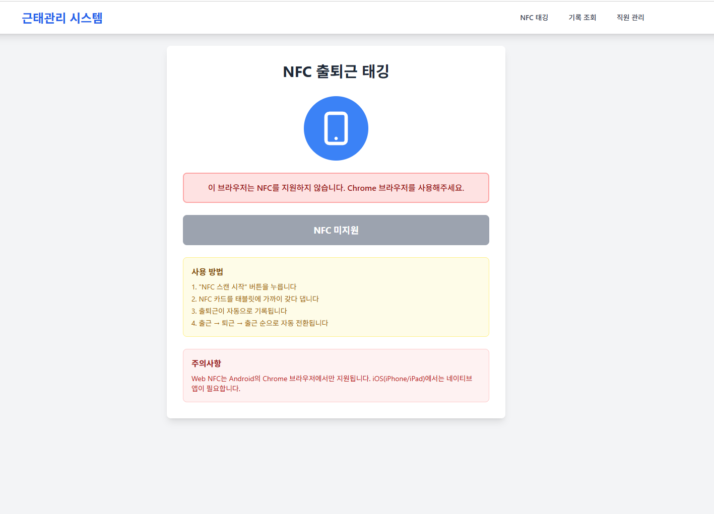
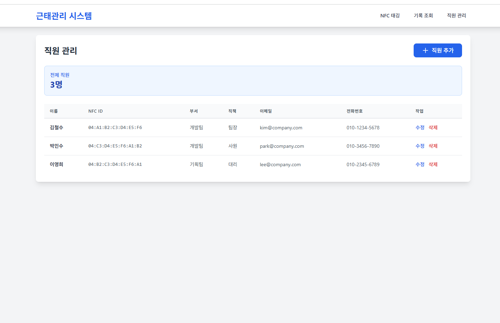
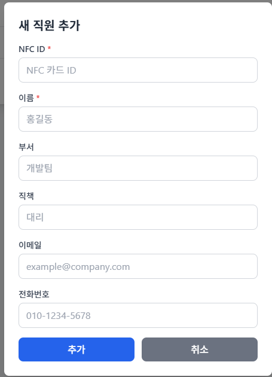

# 🏢 NFC 기반 근태관리 시스템

Android 태블릿에서 NFC 태깅을 통해 직원들의 출퇴근을 관리하는 웹 애플리케이션입니다.



## 🌐 라이브 데모
- **Frontend**: [https://hrm-frontend-3tph.onrender.com](https://hrm-frontend-3tph.onrender.com)
- **Backend API**: [https://hrm-backend-1dk5.onrender.com/api](https://hrm-backend-1dk5.onrender.com/api)
- **Health Check**: [https://hrm-backend-1dk5.onrender.com/api/health](https://hrm-backend-1dk5.onrender.com/api/health)

## 📋 목차
- [주요 기능](#-주요-기능)
- [빠른 시작](#-빠른-시작)
- [상세 설치 가이드](#-상세-설치-가이드)
- [사용 방법](#-사용-방법)
- [테스트 데이터](#-테스트-데이터)
- [기술 스택](#️-기술-스택)
- [프로젝트 구조](#️-프로젝트-구조)
- [API 문서](#-api-엔드포인트)
- [배포 가이드](#-프로덕션-배포)
- [문제 해결](#-문제-해결)
- [기여하기](#-기여)

## ✨ 주요 기능

### 📱 NFC 태깅으로 간편한 출퇴근 체크
- Android 태블릿에서 Web NFC API를 활용
- 카드를 태블릿에 태깅하면 자동으로 출근/퇴근 기록
- 마지막 태깅 기록에 따라 자동으로 출근/퇴근 구분



### 👥 직원 관리
- 직원 정보 등록 (이름, 부서, 직책, NFC ID 등)
- 직원 정보 수정 및 삭제
- NFC 카드와 직원 매칭



### 📊 출퇴근 기록 조회 및 통계
- 날짜별 출퇴근 기록 조회
- 직원별 근무 시간 통계
- 실시간 출근 현황 확인


### 📥 Excel 내보내기
- 출퇴근 기록을 Excel 파일로 다운로드
- 급여 계산 및 정산에 활용 가능

## 🚀 빠른 시작

### 전제 조건
- **Node.js** v18 이상 설치 필요
- **Android 태블릿** (NFC 지원, Chrome 브라우저)
- **NFC 카드** (직원용)

### 3분 만에 시작하기

```bash
# 1. 저장소 클론
git clone <repository-url>
cd HRM

# 2. 모든 의존성 설치
npm run install:all

# 3. 테스트 데이터 생성
cd backend
npm run seed -- --force
cd ..

# 4. 개발 서버 실행 (Backend + Frontend 동시 실행)
npm run dev
```

**접속 URL:**
- 🖥️ **로컬 개발**: http://localhost:5173
- 🌐 **라이브 데모**: https://hrm-frontend-3tph.onrender.com

## 📦 상세 설치 가이드

### 1단계: 저장소 클론 및 의존성 설치

```bash
# 저장소 클론
git clone <repository-url>
cd HRM

# 모든 패키지 설치 (Backend + Frontend)
npm run install:all
```

또는 개별 설치:
```bash
# Backend 설치
cd backend
npm install

# Frontend 설치
cd ../frontend
npm install
```

### 2단계: 환경변수 설정 (선택사항)

Backend 디렉토리에 `.env` 파일 생성:

```bash
cd backend
```

`.env` 파일 내용:
```env
PORT=3000
NODE_ENV=development
DATABASE_PATH=./attendance.db
```

> 💡 기본값으로도 작동하므로 `.env` 파일은 선택사항입니다.

### 3단계: 데이터베이스 초기화 및 테스트 데이터 생성

```bash
cd backend
npm run seed -- --force
```

이 명령은 다음을 생성합니다:
- ✅ 3명의 샘플 직원 데이터
- ✅ 최근 7일간의 출퇴근 기록 (45건)

### 4단계: 서버 실행

**루트 디렉토리에서 실행 (추천)**
```bash
npm run dev
```
Backend(포트 3000)와 Frontend(포트 5173)가 동시에 실행됩니다.

**개별 실행**
```bash
# Backend만 실행
npm run dev:backend

# Frontend만 실행  
npm run dev:frontend
```

### 5단계: 접속

- **Frontend**: http://localhost:5173
- **Backend API**: http://localhost:3000/api

## 📱 사용 방법

### 1️⃣ 직원 등록하기

1. 웹 애플리케이션에 접속
2. 상단 메뉴에서 **"직원 관리"** 클릭
3. **"직원 추가"** 버튼 클릭
4. 직원 정보 입력:
   - **이름**: 직원 이름
   - **NFC ID**: NFC 카드의 시리얼 번호 (예: `04:A1:B2:C3:D4:E5:F6`)
   - **부서**: 소속 부서
   - **직책**: 직급/직책
   - **이메일**: 이메일 주소
   - **전화번호**: 연락처
5. **"저장"** 버튼 클릭



> 💡 **NFC ID 찾는 방법**: 
> - NFC 카드의 시리얼 번호 확인
> - 또는 "NFC 태깅" 페이지에서 스캔하여 확인

### 2️⃣ NFC 태깅 설정하기 (Android 태블릿)

1. Android 태블릿에서 **Chrome 브라우저** 열기
2. 다음 URL 중 하나로 접속:
   - 🌐 **라이브 데모**: https://hrm-frontend-3tph.onrender.com
   - 🏠 **로컬 개발**: http://[서버IP]:5173
3. 상단 메뉴에서 **"NFC 태깅"** 클릭
4. **"NFC 스캔 시작"** 버튼 클릭
5. NFC 권한 요청이 나타나면 **"허용"** 클릭
6. 스캔 대기 화면이 표시됨
7. 태블릿을 출입구 근처에 고정 설치


> ⚠️ **중요**: 
> - Web NFC API는 **Android의 Chrome/Edge 브라우저**에서만 작동
> - iOS(iPhone/iPad)는 지원하지 않음
> - **HTTPS 연결** 필요 (로컬 개발 시 localhost는 예외)

### 3️⃣ 출퇴근 태깅하기

1. 직원이 NFC 카드를 태블릿에 가까이 대기
2. 자동으로 NFC ID 인식
3. 출근/퇴근 자동 판단:
   - **출근**: 오늘 첫 태깅 또는 마지막 기록이 퇴근인 경우
   - **퇴근**: 오늘 마지막 기록이 출근인 경우
4. 화면에 결과 표시:
   - ✅ 성공: 직원 이름, 시간, 출근/퇴근 표시
   - ❌ 실패: 오류 메시지 표시


### 4️⃣ 기록 조회 및 Excel 내보내기

1. 상단 메뉴에서 **"대시보드"** 또는 **"기록 조회"** 클릭
2. 날짜 필터 설정 (선택사항):
   - 시작 날짜 선택
   - 종료 날짜 선택
3. 출퇴근 기록 확인
4. **"Excel 내보내기"** 버튼 클릭
5. Excel 파일 자동 다운로드


## 🧪 테스트 데이터

시스템을 빠르게 테스트하기 위한 샘플 데이터가 제공됩니다.

### 로컬 개발 환경에서 생성

```bash
cd backend
npm run seed -- --force
```

### 배포된 환경에서 생성 (Seed API 사용)

브라우저 콘솔(F12)에서 실행:

```javascript
// 라이브 데모 환경
fetch('https://hrm-backend-1dk5.onrender.com/api/seed', {
  method: 'POST',
  headers: { 'Content-Type': 'application/json' }
})
.then(res => res.json())
.then(data => {
  console.log('✅ 테스트 데이터 생성 완료!', data);
  alert('테스트 데이터가 생성되었습니다! 페이지를 새로고침하세요.');
});

// 로컬 개발 환경
fetch('http://localhost:3000/api/seed', {
  method: 'POST',
  headers: { 'Content-Type': 'application/json' }
})
.then(res => res.json())
.then(data => console.log(data));
```

또는 cURL로 실행:

```bash
# 라이브 데모
curl -X POST https://hrm-backend-1dk5.onrender.com/api/seed

# 로컬 개발
curl -X POST http://localhost:3000/api/seed
```

### 생성되는 데이터

#### 👥 직원 3명
| 이름 | 부서 | 직책 | NFC ID |
|------|------|------|--------|
| 김철수 | 개발팀 | 팀장 | `04:A1:B2:C3:D4:E5:F6` |
| 이영희 | 기획팀 | 대리 | `04:B2:C3:D4:E5:F6:A1` |
| 박민수 | 개발팀 | 사원 | `04:C3:D4:E5:F6:A1:B2` |

#### 📊 출퇴근 기록
- **최근 7일간** 출퇴근 데이터 자동 생성
- **총 45건**의 기록 (출근 24건, 퇴근 21건)
- 현실적인 시간대:
  - 김철수: 8:45~9:05 출근, 18:30~19:00 퇴근
  - 이영희: 8:50~9:05 출근, 18:00~18:20 퇴근
  - 박민수: 8:55~9:05 출근, 18:10~18:35 퇴근
- 특별 케이스: 박민수는 2일 전 지각 기록 포함 (9:15 출근)

### 실제 NFC 카드 없이 테스트하기

브라우저 개발자 도구(F12)를 사용하여 테스트할 수 있습니다:

```javascript
// 라이브 데모 환경에서 출근 태깅 테스트
fetch('https://hrm-backend-1dk5.onrender.com/api/attendance', {
  method: 'POST',
  headers: { 'Content-Type': 'application/json' },
  body: JSON.stringify({ nfc_id: '04:A1:B2:C3:D4:E5:F6' })
})
.then(res => res.json())
.then(data => {
  console.log('✅ 태깅 결과:', data);
  alert(`${data.employee_name} - ${data.tag_type === 'check_in' ? '출근' : '퇴근'} 완료!`);
});

// 로컬 개발 환경
fetch('http://localhost:3000/api/attendance', {
  method: 'POST',
  headers: { 'Content-Type': 'application/json' },
  body: JSON.stringify({ nfc_id: '04:A1:B2:C3:D4:E5:F6' })
})
.then(res => res.json())
.then(data => console.log(data));
```

**여러 직원 연속 태깅 시뮬레이션:**
```javascript
const employees = [
  '04:A1:B2:C3:D4:E5:F6',  // 김철수
  '04:B2:C3:D4:E5:F6:A1',  // 이영희
  '04:C3:D4:E5:F6:A1:B2'   // 박민수
];

async function simulateTagging() {
  for (const nfcId of employees) {
    const res = await fetch('https://hrm-backend-1dk5.onrender.com/api/attendance', {
      method: 'POST',
      headers: { 'Content-Type': 'application/json' },
      body: JSON.stringify({ nfc_id: nfcId })
    });
    const data = await res.json();
    console.log(`✅ ${data.employee_name}: ${data.tag_type === 'check_in' ? '출근' : '퇴근'}`);
  }
  alert('모든 직원 태깅 완료! 페이지를 새로고침하세요.');
}

simulateTagging();
```

## 🛠️ 기술 스택

### Backend
| 기술 | 용도 |
|------|------|
| Node.js | 서버 런타임 |
| Express | 웹 프레임워크 |
| TypeScript | 타입 안정성 |
| SQLite | 데이터베이스 |
| better-sqlite3 | SQLite 드라이버 |
| XLSX | Excel 파일 생성 |

### Frontend
| 기술 | 용도 |
|------|------|
| React 18 | UI 라이브러리 |
| TypeScript | 타입 안정성 |
| Vite | 빌드 도구 |
| TailwindCSS | 스타일링 |
| React Router | 페이지 라우팅 |
| Axios | HTTP 통신 |
| Web NFC API | NFC 태그 읽기 |

## 🏗️ 프로젝트 구조

```
HRM/
├── backend/                    # Backend API 서버
│   ├── src/
│   │   ├── config/
│   │   │   └── database.ts    # SQLite 데이터베이스 설정
│   │   ├── models/
│   │   │   ├── employee.ts    # 직원 모델
│   │   │   └── attendance.ts  # 출퇴근 모델
│   │   ├── controllers/
│   │   │   ├── employeeController.ts
│   │   │   └── attendanceController.ts
│   │   ├── routes/
│   │   │   ├── employees.ts   # 직원 API 라우트
│   │   │   ├── attendance.ts  # 출퇴근 API 라우트
│   │   │   └── seed.ts        # 테스트 데이터 생성 API
│   │   ├── seed.ts            # 테스트 데이터 생성 스크립트
│   │   └── index.ts           # 서버 진입점
│   ├── attendance.db          # SQLite 데이터베이스
│   ├── package.json
│   └── tsconfig.json
│
├── frontend/                  # React 프론트엔드
│   ├── src/
│   │   ├── pages/
│   │   │   ├── DashboardPage.tsx      # 대시보드
│   │   │   ├── EmployeesPage.tsx      # 직원 관리
│   │   │   └── NFCTagPage.tsx         # NFC 태깅
│   │   ├── services/
│   │   │   └── api.ts                 # API 통신
│   │   ├── types/
│   │   │   └── index.ts               # TypeScript 타입
│   │   ├── App.tsx                    # 메인 앱
│   │   └── main.tsx                   # 진입점
│   ├── package.json
│   └── vite.config.ts
│
├── docs/                      # 문서 및 이미지
│   └── images/               # 스크린샷
│
├── package.json              # 루트 패키지 (워크스페이스)
└── README.md                 # 이 문서
```

## 🗄️ 데이터베이스 스키마

### employees (직원)
```sql
CREATE TABLE employees (
  id INTEGER PRIMARY KEY AUTOINCREMENT,
  nfc_id TEXT UNIQUE NOT NULL,      -- NFC 카드 ID
  name TEXT NOT NULL,                -- 이름
  department TEXT,                   -- 부서
  position TEXT,                     -- 직책
  email TEXT,                        -- 이메일
  phone TEXT,                        -- 전화번호
  created_at DATETIME DEFAULT CURRENT_TIMESTAMP,
  updated_at DATETIME DEFAULT CURRENT_TIMESTAMP
);

CREATE INDEX idx_nfc_id ON employees(nfc_id);
```

### attendance_records (출퇴근 기록)
```sql
CREATE TABLE attendance_records (
  id INTEGER PRIMARY KEY AUTOINCREMENT,
  employee_id INTEGER NOT NULL,     -- 직원 ID (FK)
  nfc_id TEXT NOT NULL,             -- NFC 카드 ID
  tag_type TEXT NOT NULL            -- 'check_in' 또는 'check_out'
    CHECK(tag_type IN ('check_in', 'check_out')),
  tag_time DATETIME DEFAULT CURRENT_TIMESTAMP,
  created_at DATETIME DEFAULT CURRENT_TIMESTAMP,
  FOREIGN KEY (employee_id) REFERENCES employees(id) ON DELETE CASCADE
);

CREATE INDEX idx_employee_id ON attendance_records(employee_id);
CREATE INDEX idx_tag_time ON attendance_records(tag_time);
```

## 🔌 API 엔드포인트

### 직원 관리 API

#### 전체 직원 조회
```http
GET /api/employees
```
**응답 예시:**
```json
[
  {
    "id": 1,
    "nfc_id": "04:A1:B2:C3:D4:E5:F6",
    "name": "김철수",
    "department": "개발팀",
    "position": "팀장",
    "email": "kim@company.com",
    "phone": "010-1234-5678"
  }
]
```

#### 직원 추가
```http
POST /api/employees
Content-Type: application/json

{
  "nfc_id": "04:A1:B2:C3:D4:E5:F6",
  "name": "김철수",
  "department": "개발팀",
  "position": "팀장",
  "email": "kim@company.com",
  "phone": "010-1234-5678"
}
```

#### NFC ID로 직원 조회
```http
GET /api/employees/nfc/:nfc_id
```

#### 직원 수정
```http
PUT /api/employees/:id
```

#### 직원 삭제
```http
DELETE /api/employees/:id
```

### 출퇴근 기록 API

#### 출퇴근 기록 조회
```http
GET /api/attendance?start_date=2024-01-01&end_date=2024-01-31
```

#### NFC 태깅 (출퇴근 기록 생성)
```http
POST /api/attendance
Content-Type: application/json

{
  "nfc_id": "04:A1:B2:C3:D4:E5:F6"
}
```

**응답 예시:**
```json
{
  "id": 123,
  "employee_id": 1,
  "employee_name": "김철수",
  "nfc_id": "04:A1:B2:C3:D4:E5:F6",
  "tag_type": "check_in",
  "message": "출근 처리되었습니다."
}
```

#### Excel 내보내기
```http
GET /api/attendance/export/excel?start_date=2024-01-01&end_date=2024-01-31
```

#### 기록 삭제
```http
DELETE /api/attendance/:id
```

### 테스트 데이터 생성 API

#### Seed 데이터 생성 (테스트용)
```http
POST /api/seed
Content-Type: application/json
```

**응답 예시:**
```json
{
  "success": true,
  "message": "테스트 데이터가 생성되었습니다!",
  "data": {
    "employees": 3,
    "checkIn": 24,
    "checkOut": 21,
    "total": 45
  }
}
```

> ⚠️ **주의**: 이 API는 기존 데이터를 모두 삭제하고 새로운 테스트 데이터를 생성합니다.  
> 프로덕션 환경에서는 환경변수로 비활성화하는 것을 권장합니다.

## 🌐 프로덕션 배포

### 🚀 현재 배포된 환경

이 프로젝트는 **Render**를 통해 배포되어 있습니다:

| 서비스 | URL | 상태 |
|--------|-----|------|
| Frontend | [hrm-frontend-3tph.onrender.com](https://hrm-frontend-3tph.onrender.com) | ✅ 운영 중 |
| Backend API | [hrm-backend-1dk5.onrender.com](https://hrm-backend-1dk5.onrender.com/api) | ✅ 운영 중 |
| Health Check | [/api/health](https://hrm-backend-1dk5.onrender.com/api/health) | ✅ 정상 |

### 배포 아키텍처

```
┌─────────────────────────────────────────────────┐
│  Render Platform (render.yaml)                   │
├─────────────────────────────────────────────────┤
│                                                   │
│  ┌─────────────────┐      ┌──────────────────┐ │
│  │  Frontend       │      │  Backend         │ │
│  │  (Vite Preview) │─────▶│  (Express API)   │ │
│  │  Port: 4173     │      │  Port: 3000      │ │
│  └─────────────────┘      └──────────────────┘ │
│          │                         │            │
│          │                    ┌────▼─────┐     │
│          │                    │ SQLite DB │     │
│          │                    └──────────┘     │
└─────────────────────────────────────────────────┘
```

### Backend 배포 상세

**플랫폼**: Render  
**빌드 명령어**: `npm install --include=dev && npm run build`  
**시작 명령어**: `npm start`  
**루트 디렉토리**: `backend`

**환경변수:**
```env
PORT=3000
NODE_ENV=production
DATABASE_PATH=./attendance.db
FRONTEND_URL=https://hrm-frontend-3tph.onrender.com
```

**빌드 스크립트:**
```bash
cd backend
npm run build    # TypeScript 컴파일
npm start        # node dist/index.js 실행
```

### Frontend 배포 상세

**플랫폼**: Render  
**빌드 명령어**: `npm install && npm run build`  
**시작 명령어**: `npm run preview`  
**루트 디렉토리**: `frontend`

**환경변수:**
```env
VITE_API_URL=https://hrm-backend-1dk5.onrender.com/api
PORT=4173
```

**빌드 스크립트:**
```bash
cd frontend
npm run build      # Vite 빌드 (dist 폴더 생성)
npm run preview    # Vite 프리뷰 서버 (프로덕션 모드)
```

### 🔧 자동 배포 설정

이 프로젝트는 `render.yaml` Blueprint를 사용하여 **모노레포 자동 배포**를 구현했습니다:

```yaml
services:
  # Backend 서비스
  - type: web
    name: hrm-backend
    runtime: node
    rootDir: backend
    buildCommand: npm install --include=dev && npm run build
    startCommand: npm start
    
  # Frontend 서비스
  - type: web
    name: hrm-frontend
    runtime: node
    rootDir: frontend
    buildCommand: npm install && npm run build
    startCommand: npm run preview
```

**장점:**
- ✅ GitHub에 Push만 하면 자동 배포
- ✅ Backend와 Frontend 동시 배포
- ✅ 환경변수 자동 주입
- ✅ 무료 플랜으로 시작 가능

### 다른 플랫폼에 배포하기

#### Vercel (Frontend만)
```bash
cd frontend
npm install -g vercel
vercel --prod
```

#### Railway (Backend + Frontend)
```bash
# Railway CLI 설치
npm install -g @railway/cli

# 프로젝트 연결
railway login
railway init
railway up
```

#### Docker로 배포
```dockerfile
# Backend Dockerfile
FROM node:18-alpine
WORKDIR /app
COPY backend/package*.json ./
RUN npm install
COPY backend/ ./
RUN npm run build
EXPOSE 3000
CMD ["npm", "start"]
```

### 중요 사항

⚠️ **필수 설정:**
1. **HTTPS 필수**: Web NFC API는 HTTPS 환경에서만 작동
2. **CORS 설정**: Backend에서 Frontend URL 허용 필요
3. **환경변수**: `VITE_API_URL`과 `FRONTEND_URL` 반드시 설정
4. **DB 백업**: SQLite 파일 정기 백업 권장

### 배포 후 체크리스트

- [ ] Backend Health Check 확인 (`/api/health`)
- [ ] Frontend 접속 확인
- [ ] CORS 오류 없이 API 호출 가능한지 확인
- [ ] Seed API로 테스트 데이터 생성
- [ ] 직원 등록 및 조회 테스트
- [ ] (선택) Android 태블릿에서 NFC 테스트

## 🔒 보안 고려사항

1. **HTTPS 필수**: Web NFC API는 HTTPS 환경에서만 작동
2. **NFC ID 보안**: 카드 분실 시 즉시 시스템에서 삭제
3. **인증/권한**: 프로덕션에서는 관리자 인증 기능 추가 권장
4. **데이터 백업**: 정기적으로 SQLite DB 파일 백업
5. **CORS 설정**: Backend에서 허용할 도메인 제한
6. **입력 검증**: 모든 사용자 입력에 대한 검증 필수

## 🐛 문제 해결

### NFC가 작동하지 않는 경우

**문제**: "NFC를 지원하지 않는 기기입니다" 메시지가 표시됨

**해결 방법:**
1. ✅ Android 기기인지 확인 (iOS는 지원 안 함)
2. ✅ 기기 설정에서 NFC 활성화 확인
3. ✅ Chrome 또는 Edge 브라우저 사용 확인
4. ✅ HTTPS 연결 확인 (로컬에서는 localhost도 가능)
5. ✅ 브라우저 버전이 최신인지 확인

**추가 디버깅:**
```javascript
// 브라우저 콘솔에서 실행
if ('NDEFReader' in window) {
  console.log('Web NFC 지원됨');
} else {
  console.log('Web NFC 지원 안 됨');
}
```

### 데이터베이스 초기화

**문제**: 데이터베이스가 손상되었거나 초기화가 필요함

**해결 방법:**
```bash
# Backend 디렉토리에서
cd backend

# 데이터베이스 파일 삭제
rm attendance.db

# 서버 재시작 (데이터베이스 자동 재생성)
npm run dev

# 테스트 데이터 추가
npm run seed -- --force
```

### 포트 충돌

**문제**: "Port 3000 is already in use" 오류

**해결 방법:**
```bash
# Windows에서 포트 사용 중인 프로세스 종료
netstat -ano | findstr :3000
taskkill /PID [프로세스ID] /F

# 또는 .env 파일에서 포트 변경
PORT=3001
```

### CORS 오류

**문제**: Frontend에서 Backend API 호출 시 CORS 오류 발생

**해결 방법:**

`backend/src/index.ts`에서 CORS 설정 확인:
```typescript
app.use(cors({
  origin: ['http://localhost:5173', 'https://your-frontend-domain.com'],
  credentials: true
}));
```

### Excel 다운로드 안 됨

**문제**: Excel 내보내기 버튼 클릭 시 다운로드되지 않음

**해결 방법:**
1. 브라우저 팝업 차단 해제 확인
2. 브라우저 콘솔에서 오류 메시지 확인
3. Backend 서버가 정상 실행 중인지 확인
4. 네트워크 탭에서 API 응답 확인

## 👨‍💻 개발 환경 및 도구

### 필수 요구사항
- **Node.js**: v18.x 이상
- **npm**: v9.x 이상
- **Git**: 버전 관리
- **VSCode**: 추천 IDE

### 추천 VSCode 확장
- ESLint
- Prettier
- TypeScript Vue Plugin (Volar)
- Tailwind CSS IntelliSense
- SQLite Viewer

### 개발 모드에서 사용 가능한 스크립트

```bash
# 루트 디렉토리
npm run dev              # Backend + Frontend 동시 실행
npm run dev:backend      # Backend만 실행
npm run dev:frontend     # Frontend만 실행
npm run install:all      # 모든 의존성 설치
npm run build            # Backend + Frontend 빌드

# Backend 디렉토리
npm run dev              # 개발 서버 (nodemon)
npm run build            # TypeScript 컴파일
npm start                # 프로덕션 서버
npm run seed             # 테스트 데이터 생성

# Frontend 디렉토리
npm run dev              # 개발 서버 (Vite)
npm run build            # 프로덕션 빌드
npm run preview          # 프로덕션 프리뷰
npm run lint             # ESLint 검사
```

### 환경변수 참고

**Backend (`backend/.env`)**
```env
PORT=3000                # 서버 포트
NODE_ENV=development     # 환경 (development/production)
DATABASE_PATH=./attendance.db
FRONTEND_URL=http://localhost:5173
```

**Frontend (Vite 환경변수)**
```env
VITE_API_URL=http://localhost:3000/api  # Backend API URL
```

### Git 브랜치 전략
- `main`: 프로덕션 배포 브랜치
- `develop`: 개발 통합 브랜치
- `feat/*`: 새 기능 개발
- `fix/*`: 버그 수정
- `docs/*`: 문서 업데이트

### 커밋 메시지 규칙
```
feat: 새로운 기능 추가
fix: 버그 수정
docs: 문서 수정
style: 코드 포맷팅, 세미콜론 누락 등
refactor: 코드 리팩토링
test: 테스트 코드 추가
chore: 빌드 업무 수정, 패키지 매니저 수정
```

자세한 내용은 [CONTRIBUTING.md](CONTRIBUTING.md)를 참고하세요.

## 📚 추가 리소스

### 공식 문서
- [Web NFC API 문서](https://developer.mozilla.org/en-US/docs/Web/API/Web_NFC_API)
- [React 공식 문서](https://react.dev/)
- [Express.js 문서](https://expressjs.com/)
- [SQLite 문서](https://www.sqlite.org/docs.html)
- [Vite 문서](https://vitejs.dev/)
- [Render 배포 가이드](https://render.com/docs)

### 프로젝트 문서
- [빠른 시작 가이드](QUICKSTART.md)
- [기여 가이드](CONTRIBUTING.md)
- [커밋 메시지 가이드](docs/COMMIT_MESSAGES.md)
- [개발자 문서](docs/README.md)

## 📄 라이선스

이 프로젝트는 MIT 라이선스로 배포됩니다.

## 🤝 기여

이슈 및 풀 리퀘스트를 환영합니다!

프로젝트에 기여하기 전에 **[기여 가이드](CONTRIBUTING.md)**를 읽어주세요.

### 간단한 기여 방법
1. Fork the Project
2. Create your Feature Branch (`git checkout -b feat/amazing-feature`)
3. Commit your Changes (`git commit -m 'feat: 놀라운 기능 추가'`)
4. Push to the Branch (`git push origin feat/amazing-feature`)
5. Open a Pull Request

### 📖 문서
- **[CONTRIBUTING.md](CONTRIBUTING.md)** - 코드 컨벤션 및 Git 규칙
- **[QUICKSTART.md](QUICKSTART.md)** - 빠른 시작 가이드
- **[docs/README.md](docs/README.md)** - 개발자 문서

## 📞 문의

문제가 발생하거나 질문이 있으시면 이슈를 등록해주세요.

---

**만든 사람**: HRM 개발팀  
**최종 업데이트**: 2026-01-06  
**버전**: 1.0.0  
**라이선스**: MIT  

### 🔗 주요 링크
- **GitHub**: https://github.com/hanomon/HRM
- **Live Demo**: https://hrm-frontend-3tph.onrender.com
- **API Docs**: https://hrm-backend-1dk5.onrender.com/api/health
